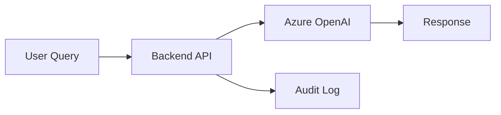

# Diagram Assets Convention

**Purpose**: Standardized diagram format, naming, and referencing conventions for EVA documentation.  
**Updated**: January 24, 2026  
**Applies to**: MkDocs PoC and broader EVA documentation ecosystem

---

## Overview

This directory contains diagrams for EVA documentation with multi-format support to ensure compatibility across different hosting platforms (SharePoint Online, Azure Static Website, ADO Wiki).

---

## Format Strategy

### Primary Format: SVG (Recommended)
**Use SVG as the primary diagram format** for all technical diagrams.

**Benefits**:
- Scalable without quality loss
- Smaller file sizes than PNG for vector graphics
- Text remains searchable and selectable
- Renders perfectly in modern browsers
- Git-friendly (text-based, easy to diff)

**Best for**:
- Architecture diagrams
- Data flow diagrams
- Network diagrams
- Process flows
- Component relationships

### Fallback Format: PNG (Required for SharePoint Online)
**Provide PNG fallback** for compatibility with platforms that restrict SVG rendering.

**When PNG is necessary**:
- SharePoint Online document libraries may block SVG rendering
- Some enterprise environments restrict SVG for security reasons
- Email attachments and offline documentation

**PNG Guidelines**:
- Resolution: 300 DPI for print quality, 150 DPI for web
- Size: Max 2000px width for web documentation
- Compression: Use PNG-8 for simple diagrams, PNG-24 for complex graphics
- Generate from SVG source to maintain consistency

### Optional: ASCII Fallback (For Accessibility)
**Include ASCII diagram in Markdown code block** for:
- Text-only documentation views
- Screen reader compatibility
- Terminal/CLI documentation
- Low-bandwidth environments

---

## Naming Convention

### File Naming Pattern
```
<topic>-<purpose>.(svg|png)
```

**Components**:
- `<topic>`: Domain or subject area (lowercase, hyphen-separated)
- `<purpose>`: Diagram purpose or view (lowercase, hyphen-separated)
- Extension: `.svg` (primary) or `.png` (fallback)

### Examples

| Diagram Type | SVG File | PNG Fallback |
|--------------|----------|--------------|
| EVA Architecture | `eva-architecture.svg` | `eva-architecture.png` |
| Data Flow | `eva-dataflow.svg` | `eva-dataflow.png` |
| RAG Pipeline | `rag-pipeline.svg` | `rag-pipeline.png` |
| Network Topology | `network-topology.svg` | `network-topology.png` |
| Authentication Flow | `auth-oauth-flow.svg` | `auth-oauth-flow.png` |
| Component Diagram | `component-backend-api.svg` | `component-backend-api.png` |

### Naming Rules
- Use lowercase only
- Separate words with hyphens (kebab-case)
- Be specific and descriptive
- Avoid abbreviations unless universally understood (e.g., `api`, `ui`, `db`)
- Include version suffix if diagram has multiple versions: `eva-architecture-v2.svg`

---

## Referencing Diagrams in Markdown

### Standard Pattern (SVG Primary + PNG Fallback)

**Recommended approach** for maximum compatibility:

```markdown
## Architecture Overview

### Diagram (SVG)


### Diagram (PNG Fallback)

```

### With Figure Captions

```markdown
## Architecture Overview

<figure>
  
  <figcaption>Figure 1: EVA high-level architecture showing RAG pipeline and Azure services</figcaption>
</figure>

**Fallback (PNG)**:  

```

### With ASCII Fallback (Optional)

For maximum accessibility and text-only environments:

```markdown
## Data Flow

### Visual Diagram


### Text-Based Diagram (ASCII)
```text
User --> [Frontend] --> [Backend API] --> [Azure OpenAI]
                             |
                             v
                        [Cosmos DB]
                             |
                             v
                      [Audit Logging]
```
```

### Relative Path Guidance

From different Markdown file locations:

| Markdown Location | Diagram Path |
|-------------------|--------------|
| `docs/index.md` | `assets/diagrams/svg/eva-architecture.svg` |
| `docs/architecture/overview.md` | `../assets/diagrams/svg/eva-architecture.svg` |
| `docs/architecture/services/backend.md` | `../../assets/diagrams/svg/component-backend-api.svg` |

**Tip**: Use `../` to go up one directory level.

---

## Creating Diagrams

### Recommended Tools

**Vector Graphics (SVG)**:
- **draw.io** (diagrams.net) - Free, web-based, exports clean SVG
- **Mermaid** - Text-based diagrams, renders to SVG
- **PlantUML** - Text-based UML diagrams
- **Lucidchart** - Commercial, team collaboration
- **Microsoft Visio** - Enterprise standard, exports to SVG

**Raster Graphics (PNG)**:
- Export from SVG using draw.io or Inkscape
- Screenshot tools for UI mockups
- Image editors: GIMP (free), Photoshop (commercial)

### Mermaid Integration (Text-Based Diagrams)

For diagrams that can be represented as code:

```markdown

```

**Note**: MkDocs Material theme supports Mermaid rendering. See MkDocs configuration for setup.

---

## File Organization

### Directory Structure
```
docs/assets/diagrams/
├── README.md (this file)
├── svg/                      # Primary SVG diagrams
│   ├── eva-architecture.svg
│   ├── eva-dataflow.svg
│   └── rag-pipeline.svg
└── png/                      # PNG fallbacks
    ├── eva-architecture.png
    ├── eva-dataflow.png
    └── rag-pipeline.png
```

### Version Control
- **Commit both SVG and PNG** to Git repository
- SVG is text-based and Git-friendly (shows diffs)
- PNG is binary but necessary for compatibility
- Use `.gitattributes` to handle binary files properly

### File Size Guidelines
- **SVG**: Keep under 500KB (optimize if larger)
- **PNG**: Keep under 1MB for web documentation
- **Complex diagrams**: Consider splitting into multiple smaller diagrams

---

## Testing Diagram Rendering

### Test Checklist

Before committing diagrams, verify rendering on:

- [ ] **Local MkDocs**: `mkdocs serve` and view in browser
- [ ] **SharePoint Online**: Upload and verify PNG renders correctly
- [ ] **Azure Static Website**: Deploy and verify SVG renders correctly
- [ ] **GitHub Markdown**: View in repository (both SVG and PNG)
- [ ] **Mobile devices**: Check responsive scaling

### Known Platform Limitations

| Platform | SVG Support | PNG Support | Notes |
|----------|-------------|-------------|-------|
| MkDocs (built HTML) | ✅ Excellent | ✅ Excellent | Both formats render perfectly |
| Azure Static Website | ✅ Excellent | ✅ Excellent | No restrictions |
| SharePoint Online | ⚠️ May block | ✅ Excellent | Security policies may prevent SVG rendering |
| ADO Wiki | ✅ Good | ✅ Excellent | Some SVG features may not render |
| GitHub Markdown | ✅ Good | ✅ Excellent | SVG interactivity limited |
| Email (Outlook) | ❌ Poor | ✅ Good | Use PNG for emails |

**Recommendation**: Always provide both SVG and PNG to cover all platforms.

---

## Maintenance

### Updating Diagrams

When updating diagrams:
1. Update the SVG source file
2. Export/regenerate the PNG fallback
3. Commit both files together
4. Update version suffix if major change: `eva-architecture-v2.svg`
5. Update Markdown references if filename changed

### Deprecating Diagrams

When deprecating outdated diagrams:
1. Move to `docs/assets/diagrams/deprecated/` folder
2. Update Markdown to remove references
3. Add deprecation note in commit message
4. Consider archiving in a separate branch

---

## Examples

### Example 1: Simple Architecture Diagram

**File**: `eva-architecture.svg`

**Content**:
```svg
<svg xmlns="http://www.w3.org/2000/svg" width="400" height="300">
  <rect x="10" y="10" width="100" height="50" fill="#4A90E2" />
  <text x="60" y="40" text-anchor="middle" fill="white">Frontend</text>
  
  <rect x="150" y="10" width="100" height="50" fill="#7ED321" />
  <text x="200" y="40" text-anchor="middle" fill="white">Backend</text>
  
  <rect x="290" y="10" width="100" height="50" fill="#F5A623" />
  <text x="340" y="40" text-anchor="middle" fill="white">Database</text>
  
  <line x1="110" y1="35" x2="150" y2="35" stroke="black" stroke-width="2" />
  <line x1="250" y1="35" x2="290" y2="35" stroke="black" stroke-width="2" />
</svg>
```

**Markdown Reference**:
```markdown
## System Architecture


*Fallback*: 
```

### Example 2: Flow Diagram with ASCII Fallback

**Markdown**:
```markdown
## Authentication Flow

### Visual Diagram


### Text Representation
```text
[User] --login--> [Frontend]
                      |
                      | POST /auth
                      v
                  [Backend API]
                      |
                      | redirect
                      v
              [Entra ID OAuth 2.0]
                      |
                      | token
                      v
                  [Backend API]
                      |
                      | set cookie
                      v
                  [Frontend]
```
```

---

## Contributing

When adding new diagrams:
1. Follow naming convention: `<topic>-<purpose>.svg`
2. Create both SVG (primary) and PNG (fallback)
3. Add entry to this README if introducing a new diagram type
4. Test rendering on multiple platforms
5. Commit both formats together

---

## Questions & Support

For questions about diagram conventions:
- See Project 10 MkDocs PoC README.md
- Contact: Marco Presta (Project Owner)
- Refer to EVA Foundation documentation standards (Project 07)

---

**Last Updated**: January 24, 2026  
**Maintained by**: EVA Foundation Team
