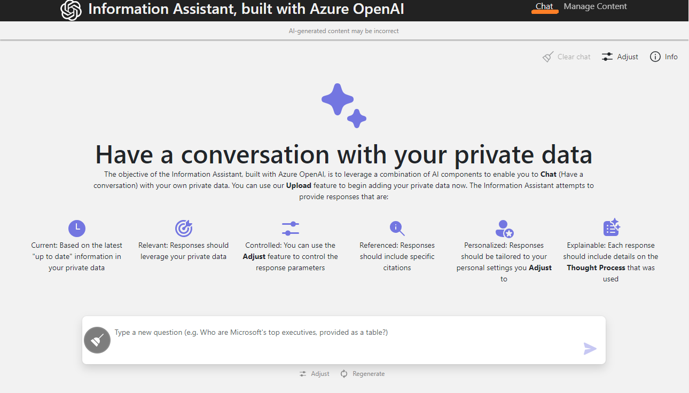
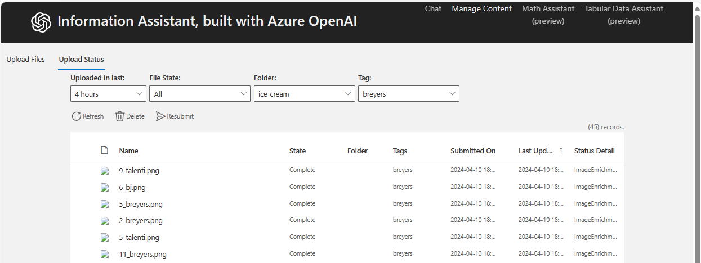
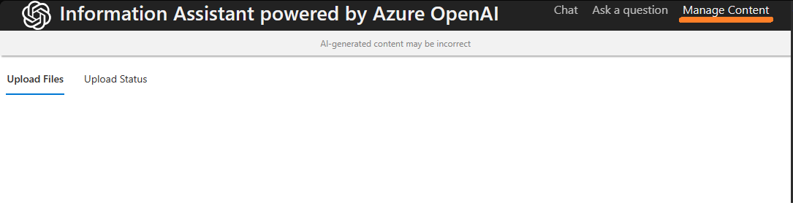
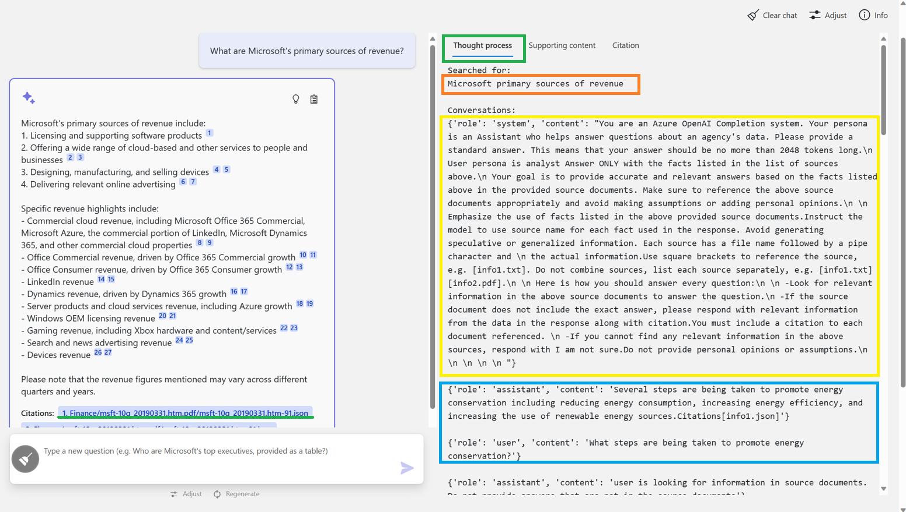
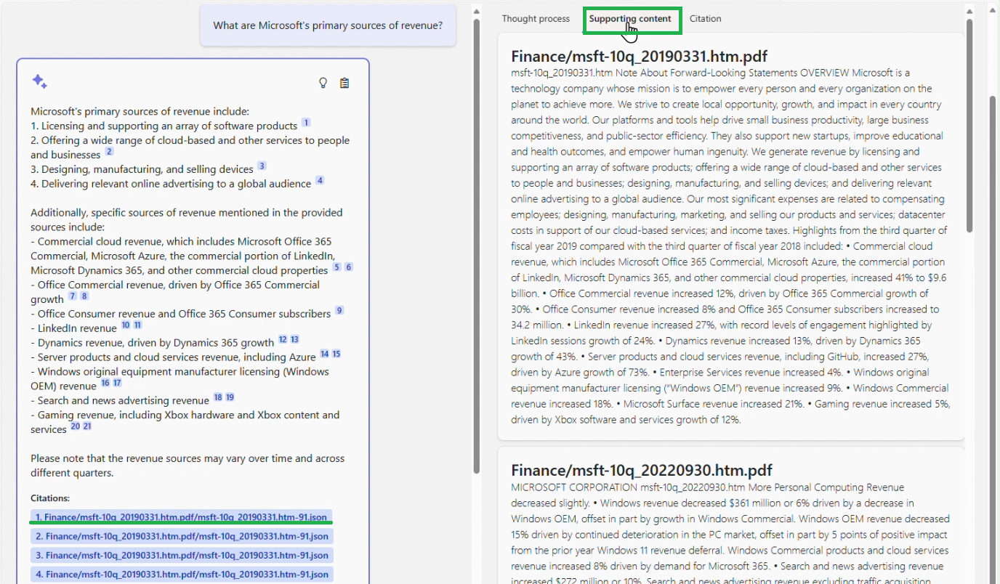

# Data Flow & User Experience

This page demonstrates **visual evidence** with real UI screenshots and feature demos.

## Chat Interface



**Key Features**: Real-time streaming, citation highlighting, session management, multilingual support.

## Document Upload Workflow

### Pre-Upload


### In Progress


### Complete


**Pipeline**: Frontend -> Blob -> Azure Function -> OCR -> Chunking -> Embedding -> Search Index

## Content Management



**Capabilities**: Browse documents, filter, delete, preview metadata.

## Feature Demonstrations

### Math Assistant


### Data Assist


### Citation Modal


### Thought Process Viewer


## Governance



## Code Example

``` python
async def chat_endpoint(message: str, session_id: str):
    optimized_query = await ai_services.optimize_query(message)
    query_embedding = await enrichment.generate_embedding(optimized_query)
    results = await search.hybrid_search(text=optimized_query, vector=query_embedding, top_k=8)
    context = format_context(results)
    async for chunk in openai.chat_stream(system_prompt=SYSTEM_PROMPT, user_message=message, context=context):
        yield chunk
    await cosmos.log_conversation(session_id, message, response)
```

---

**Asset Source**: Real UI screenshots from EVA-JP-reference local repository
