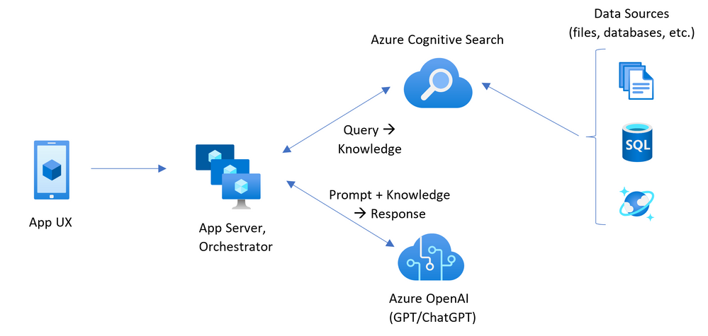
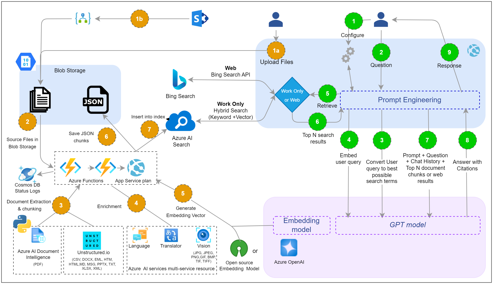
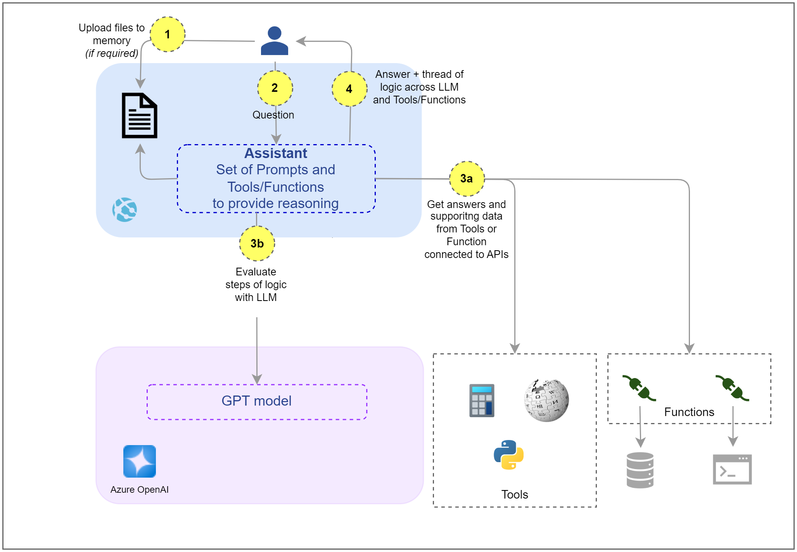
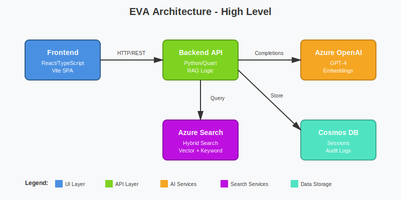

# Architecture Overview

This page demonstrates **visual evidence-based documentation** using real EVA production assets.

## Enterprise Architecture

The EVA Jurisprudence Information Assistant is a Retrieval Augmented Generation (RAG) system built on Azure OpenAI, designed for secure document Q&A in enterprise environments.

### High-Level Secure Deployment Architecture

**Purpose**: Enterprise-grade deployment with private endpoints, VNet integration, and Azure security services.

**Key Components**:
- Azure OpenAI behind private endpoints
- Azure AI Services for content safety and query optimization
- Azure Cognitive Search for hybrid vector + keyword search
- Private networking throughout (`hccld2` VNet)

### Component Architecture

**Purpose**: Logical component breakdown showing frontend, backend, functions, and data services.

## Process Flows

### Chat Process Flow

**Purpose**: Complete RAG chat flow including Work/Grounded, Ungrounded, and Work+Web modes.

**Modes**:
- **Work (Grounded)**: Search only organizational documents
- **Ungrounded**: Direct GPT-4 without retrieval
- **Work+Web**: Hybrid search across internal docs + web results

### Agent Process Flow

**Purpose**: Autonomous assistant/agent reasoning approach for complex queries.

## Sample Diagram Convention (Project 10 Standard)

For new diagrams created in Project 10, we follow this convention:

### SVG (Primary Format)

!!! note "Diagram Standards"
    **SVG + ASCII Strategy**: SVG (primary) + ASCII (accessibility)
    
    See `docs/assets/diagrams/README.md` for complete diagram standards.

### ASCII Architecture (Accessibility)

Text-based architecture diagram for accessibility:

- Frontend (React) connects via HTTP to Backend API (Python/Quart)
- Backend connects via REST to Azure OpenAI (GPT-4)
- Backend connects to Azure Search for Vector + Keyword search
- Backend connects to Cosmos DB for Sessions and Audit Logs

## Link to a section on this page

- [Jump to "Constraints"](#constraints)

## Constraints

- All services behind private endpoints (VPN/DevBox required for full access)
- Embedding generation requires Enrichment service (Flask API)
- SharePoint Online may not render SVG diagrams (use PNG fallback)

!!! warning "SharePoint Hosting Considerations"
    If hosting in SharePoint Online as "static web", test how it handles
    `.html`, `.css`, `.js` and whether relative asset paths work.
    
    **Diagram Testing**: SVG diagrams may be blocked by SharePoint security policies.
    Always test PNG fallbacks in SharePoint document libraries.

## Related Pages

- [Data Flow](data-flow.md) - Detailed data flows with UI screenshots
- [Governance Principles](../governance/principles.md) - Security and compliance

---

**Asset Source**: Real production diagrams from EVA-JP reference local repository
