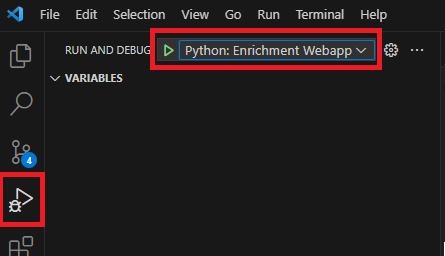
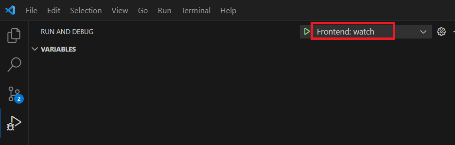
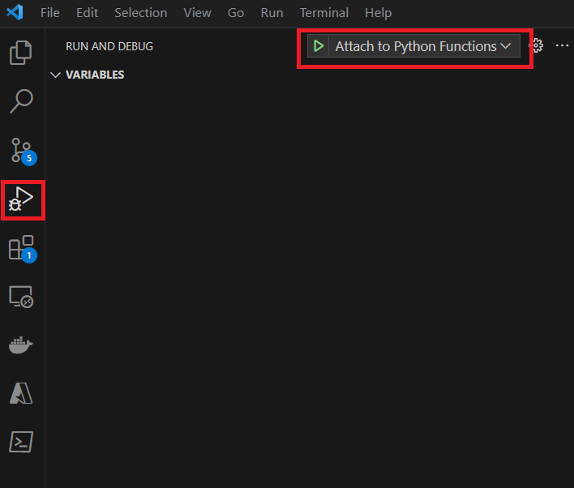
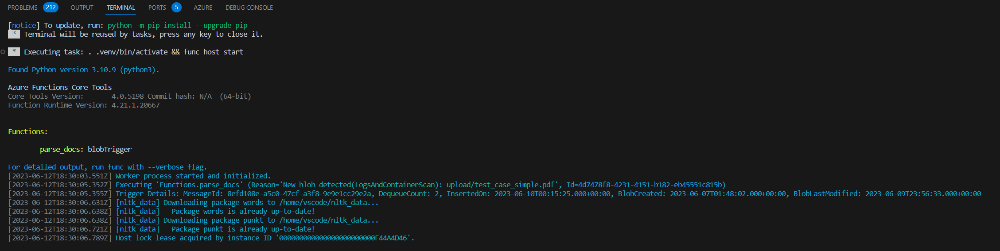
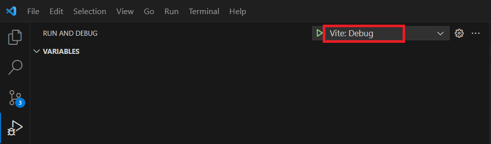
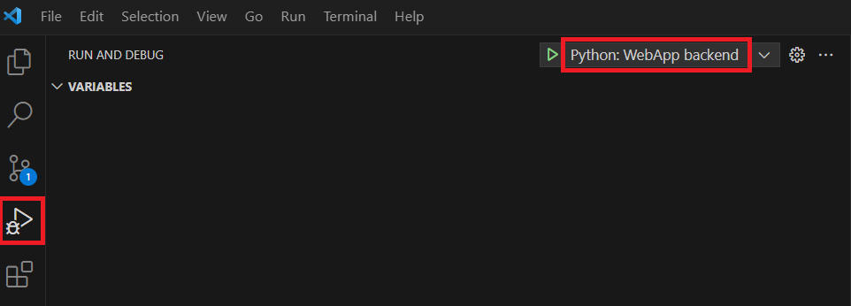
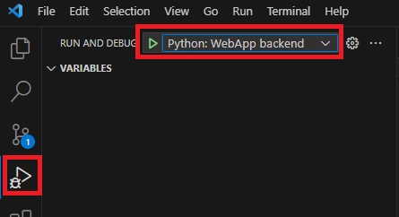
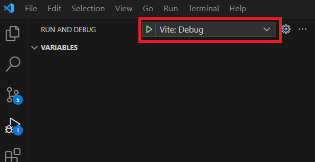
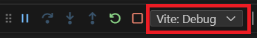
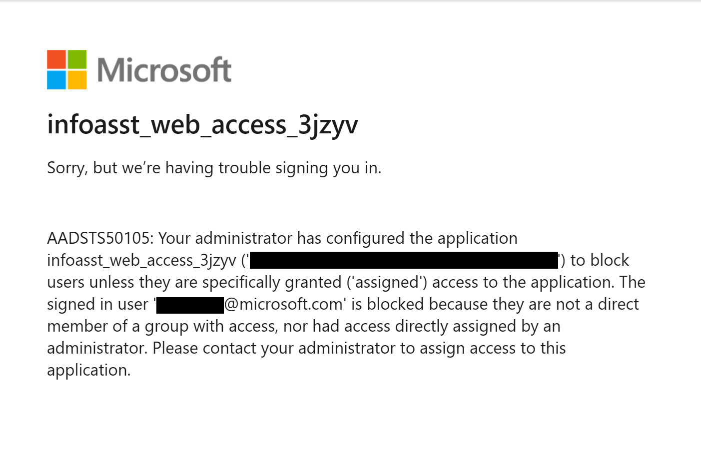

# Debugging Guide

## Debugging Screenshots

### FastAPI Debug

*Backend API debugging with breakpoints*

### Frontend Watch Mode

*Hot-reload development for frontend*

### Function Attach

*Attach debugger to Azure Functions*

### Function Running

*Azure Functions execution status*

### Vite Debug

*Vite development server debugging*

### WebApp Backend Debug

*Backend web app debugging*

### WebApp Debug Configuration 1

*Debug launch configuration*

### WebApp Debug Configuration 2

*Additional debug settings*

### WebApp Debug Configuration 3

*Advanced debugging options*

### Known Issues - Web App Authentication

*Common authentication troubleshooting*

---

**Asset Source**: Real debugging screenshots from EVA-JP-reference local repository
