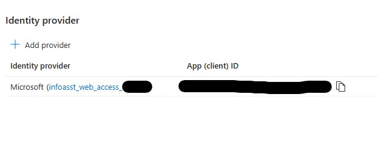
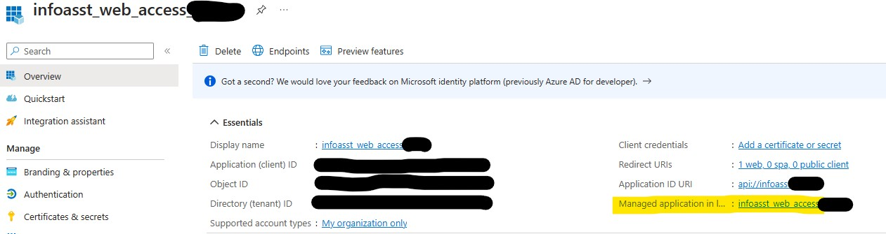
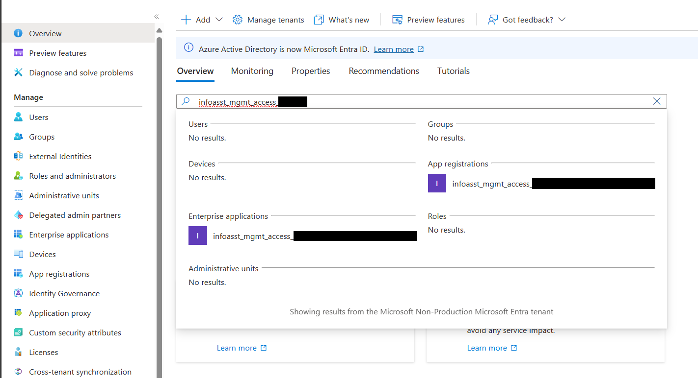

# Authentication Setup

## Authentication Configuration Screenshots

### Identity Provider Identification

*Configure identity provider for authentication*

### Managed Application

*Enterprise managed application settings*

### Credential Lifespan

*Configure credential expiration policies*

---

**Asset Source**: Real authentication setup from EVA-JP-reference local repository
