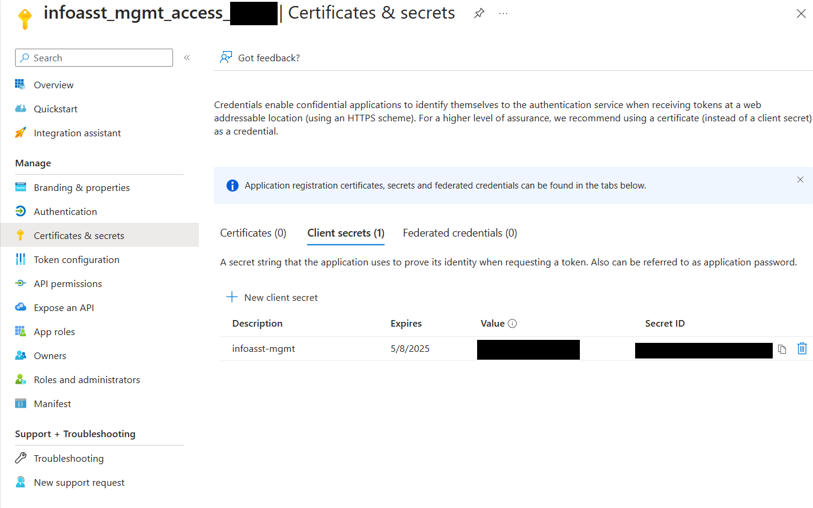
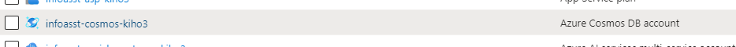
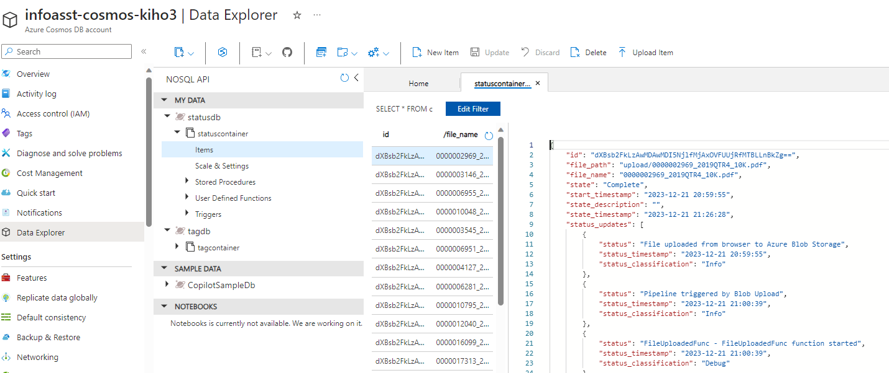
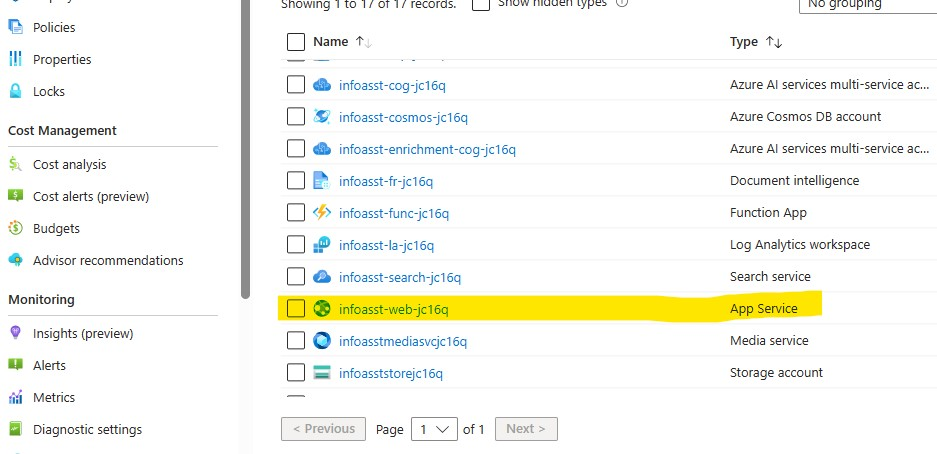
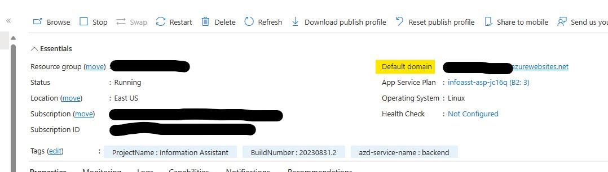

# Azure Deployment

## Azure Resource Screenshots

### App Registration

*Azure AD app registration for authentication*

### Cosmos DB Account

*Cosmos DB database and container setup*

### Data Explorer

*Query and manage Cosmos DB data*

### App Service Location

*Configure deployment region*

### Default Domain

*App Service default domain configuration*

---

**Asset Source**: Real deployment screenshots from EVA-JP-reference local repository
