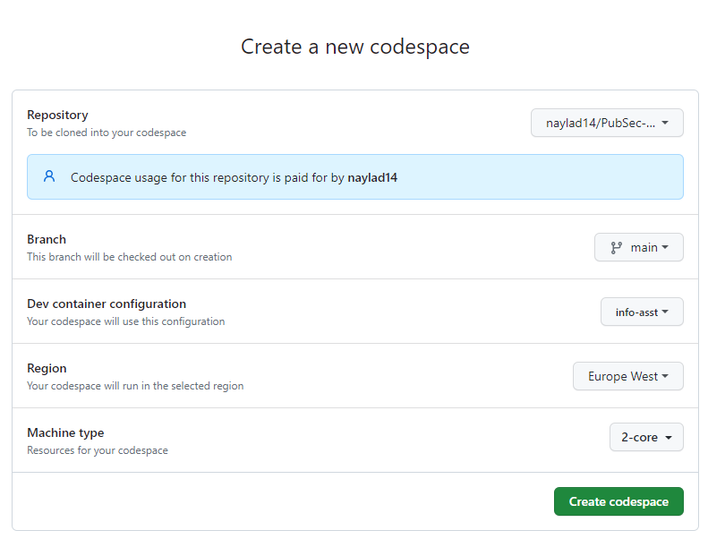
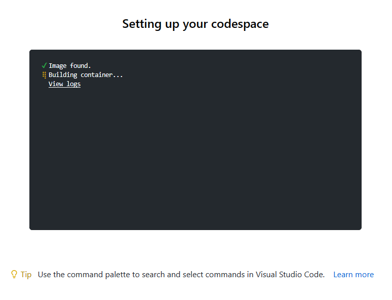
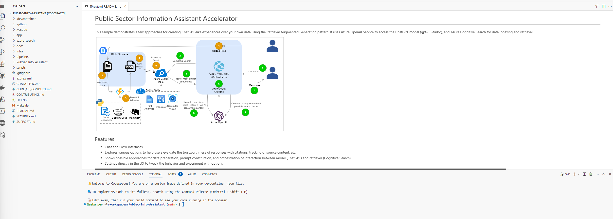
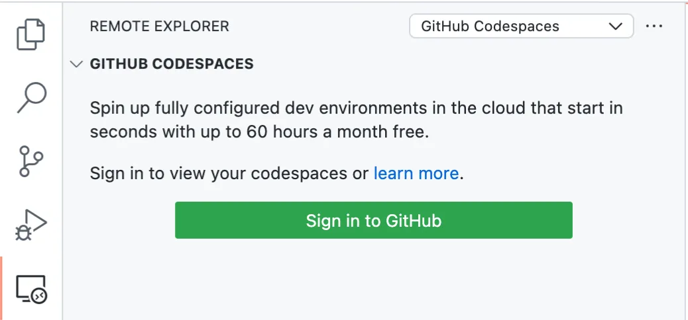
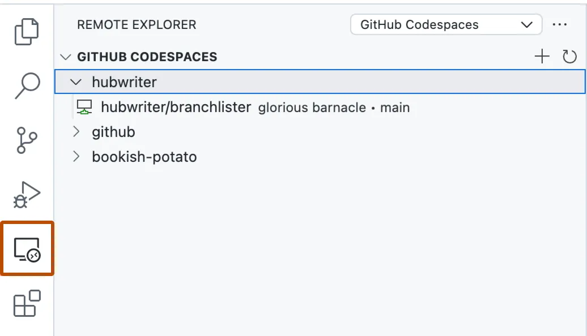
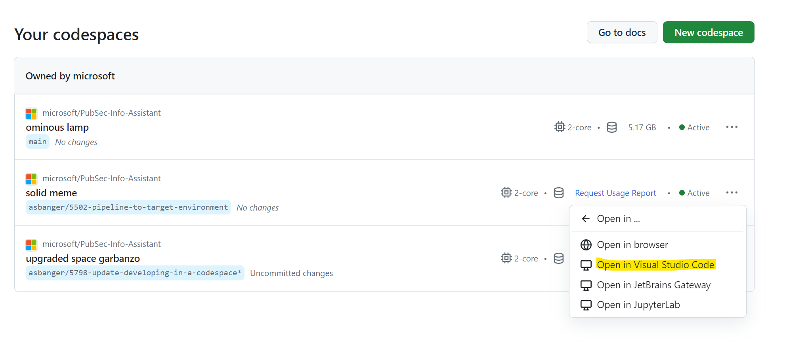
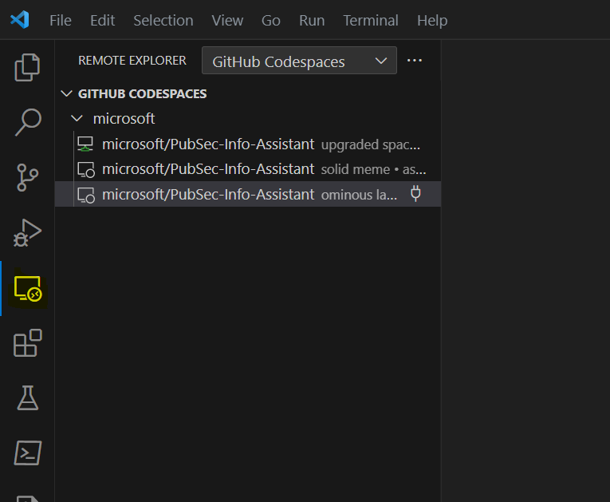
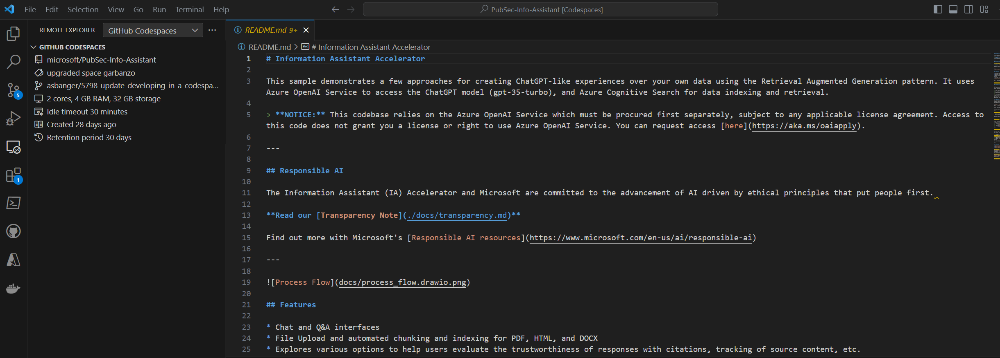

# GitHub Codespaces Setup

## Codespaces Development Screenshots

### Create Codespace

*Start a new Codespace from GitHub repository*

### Building Container

*Codespace environment setup in progress*

### Open in VS Code Desktop

*Launch Codespace in local VS Code*

### Developing in Codespaces

*Active development environment*

### Codespaces Workspace

*Workspace with files and terminal*

### Open in VS Code - Step 2

*VS Code connection process*

### Open in VS Code - Step 3

*Connecting to Codespace*

### Open in VS Code - Step 4

*Codespace ready in VS Code*

---

**Asset Source**: Real Codespaces setup from EVA-JP-reference local repository
