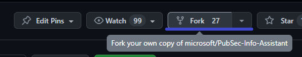
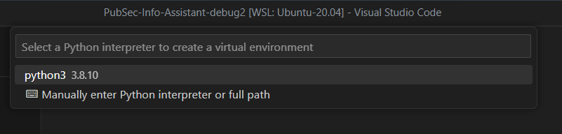
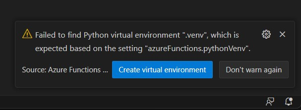
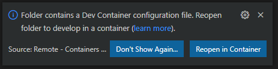
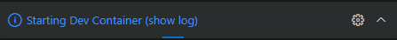
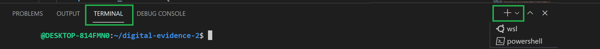

# Local Development Setup

## Local Setup Screenshots

### Fork Repository

*Fork EVA repository to your account*

### Python Version

*Check Python version compatibility*

### Virtual Environment

*Create and activate Python virtual environment*

### VS Code Reopen in Container

*Open project in development container*

### Starting Dev Container

*Development container initialization*

### VS Code Terminal (Windows)

*Integrated terminal for Windows development*

---

**Asset Source**: Real local setup from EVA-JP-reference local repository
