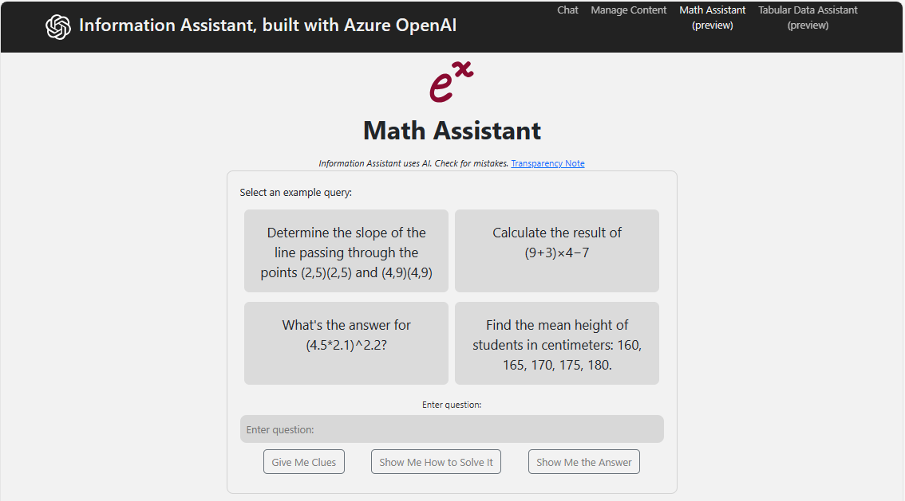
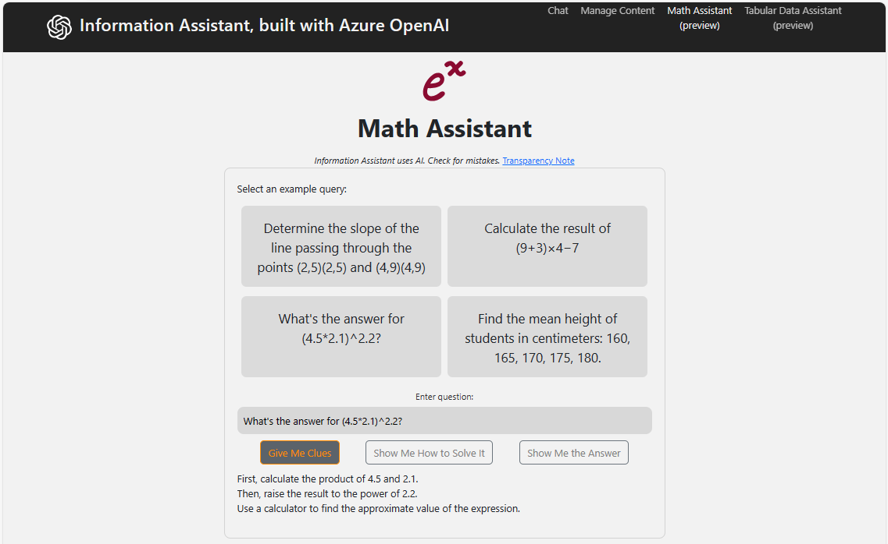
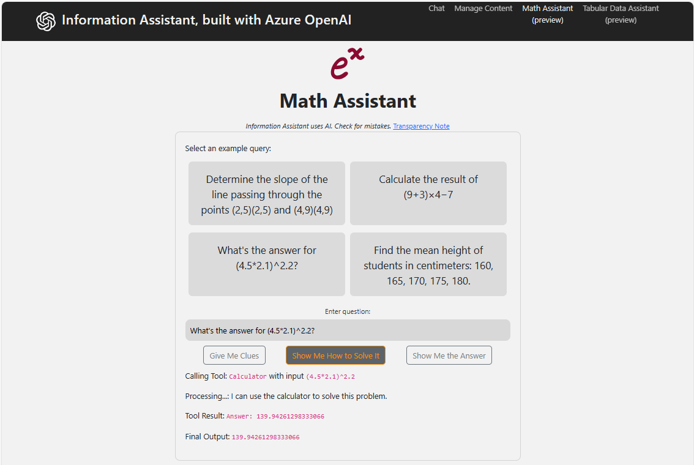
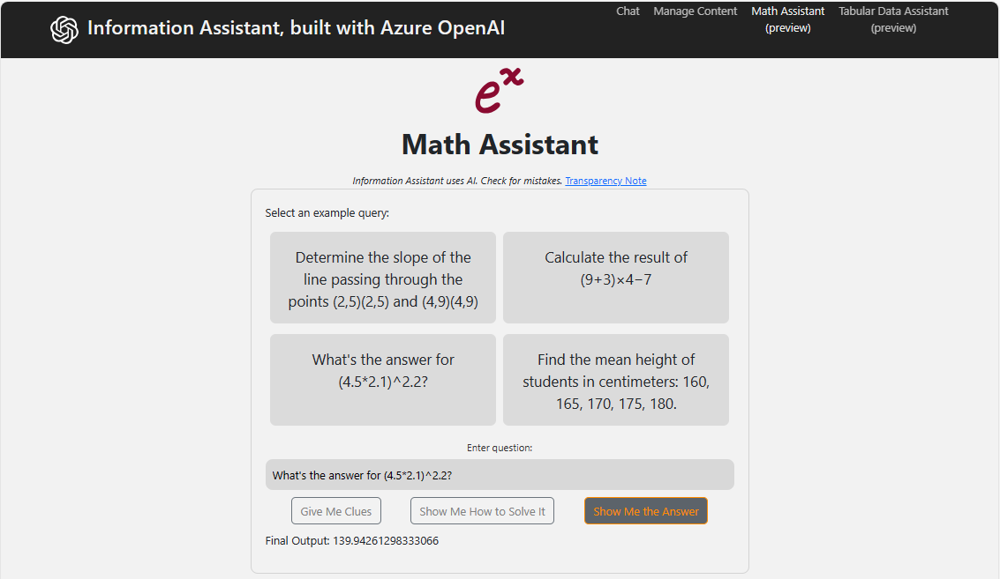
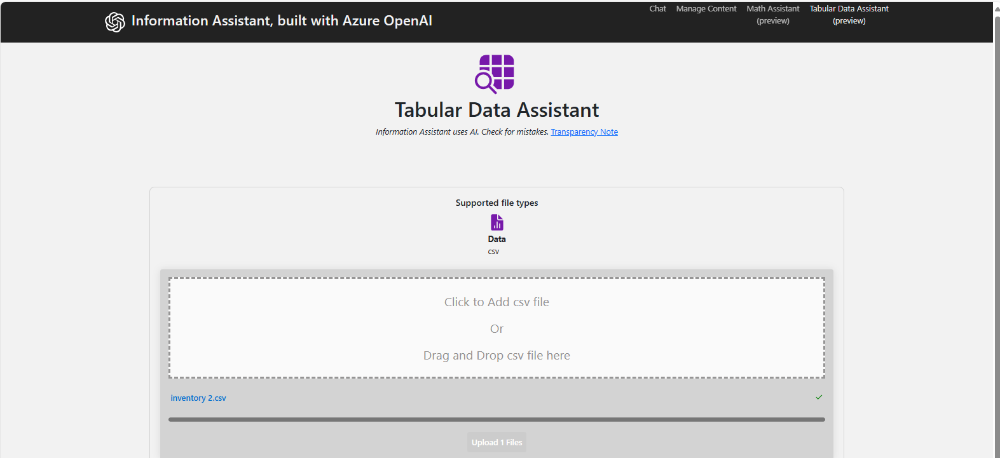
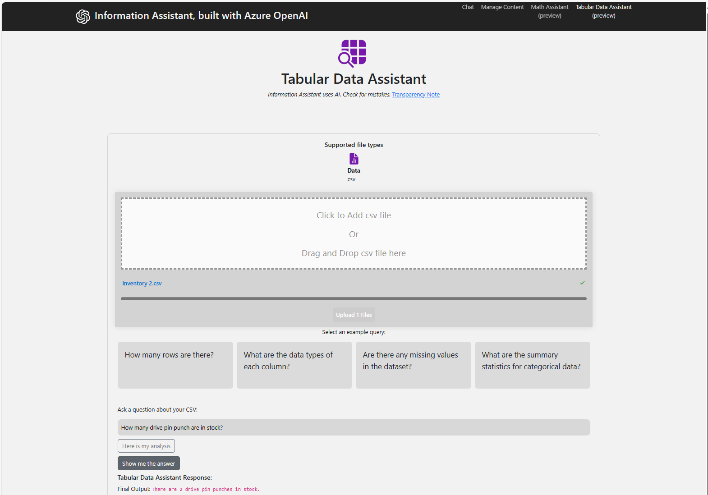
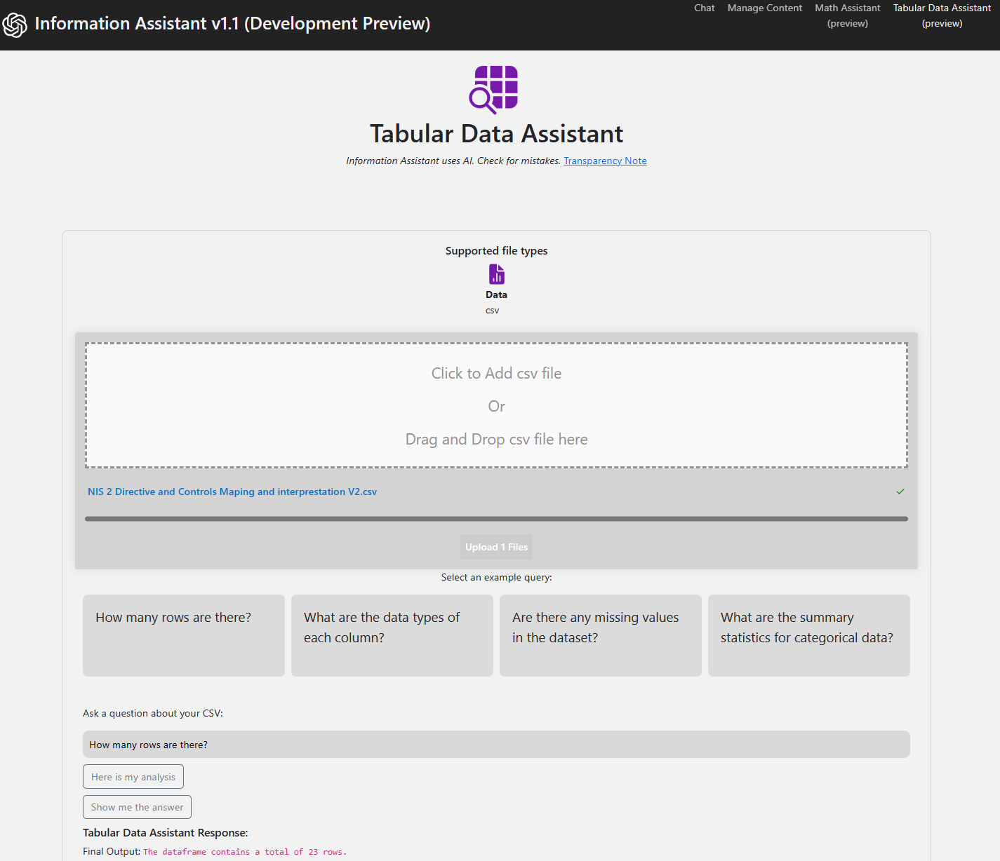

# Math Assistant & Data Assist

## Math Assistant Screenshots

### Math Assistant UI

*Main Math Assistant interface*

### Give Me Clues

*Hint mode for problem-solving guidance*

### Show Me How to Solve

*Step-by-step solution walkthrough*

### Show Me the Answer

*Direct answer display with work shown*

---

## Data Assist Screenshots

### Data Assist Upload Interface

*Upload data files for analysis*

### Data Query Example - "How many"

*Ask questions about data counts*

### Data Query Example - "How many rows"

*Query row counts and data structure*

---

**Asset Source**: Real feature screenshots from EVA-JP-reference local repository
