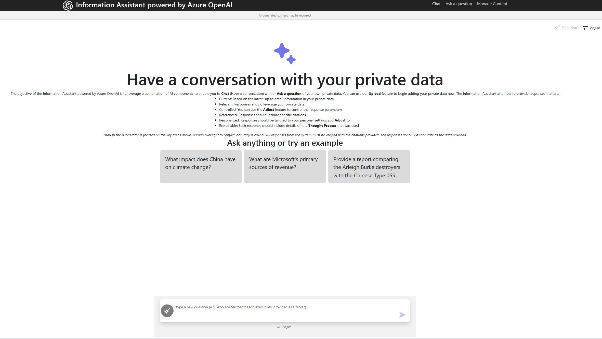
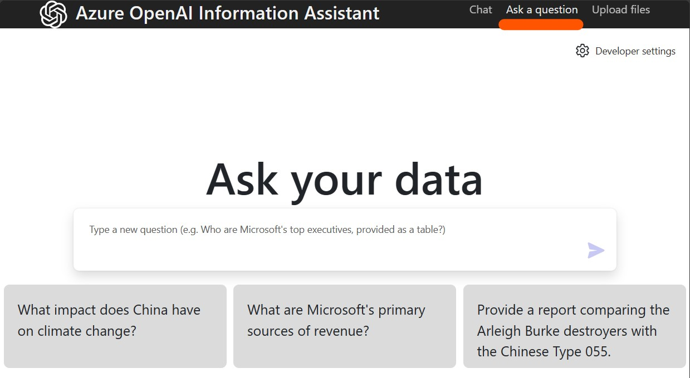
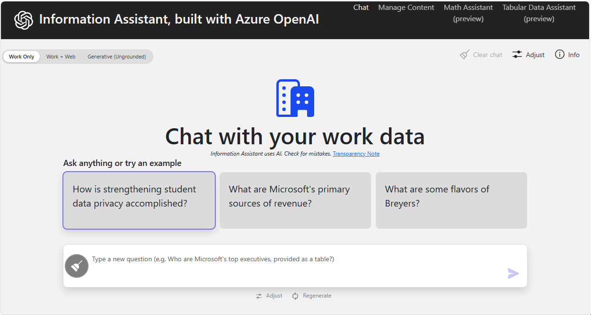
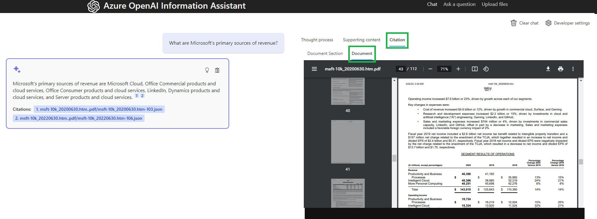
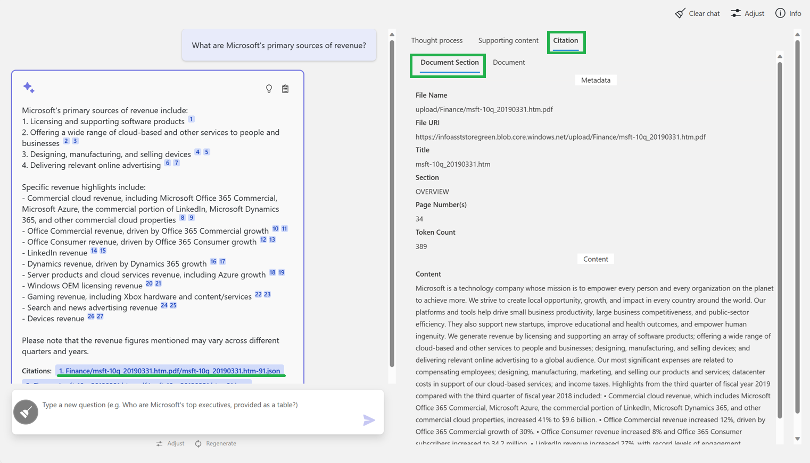
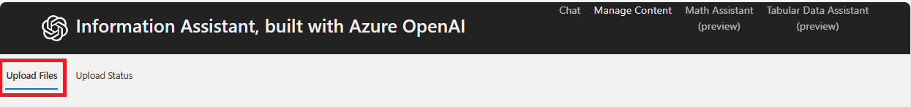
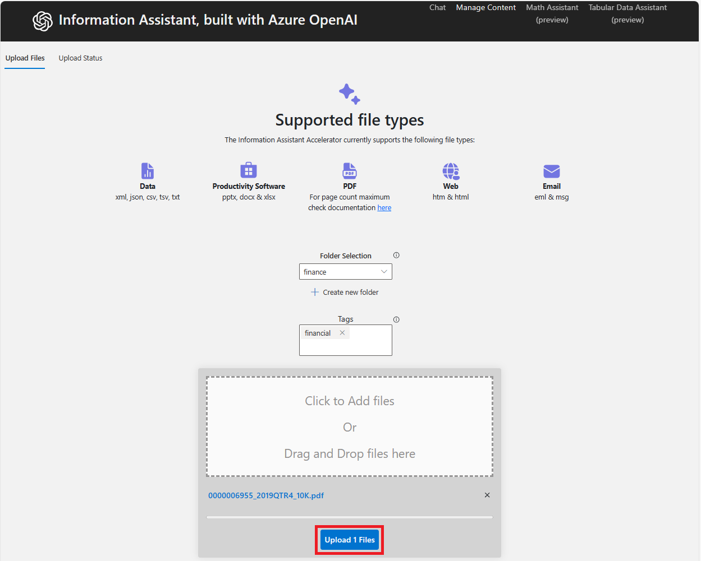
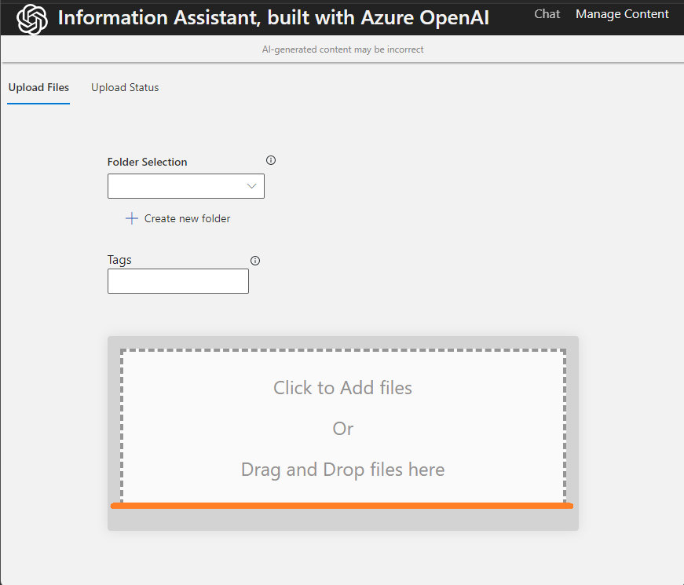
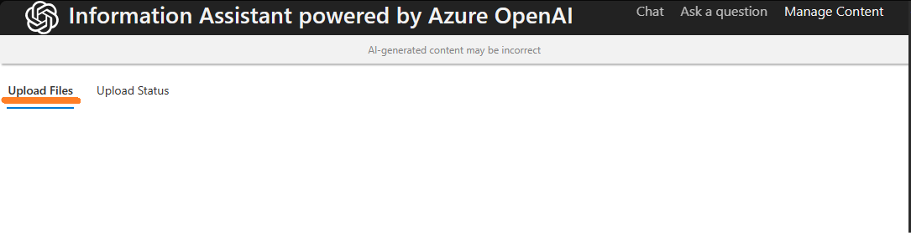
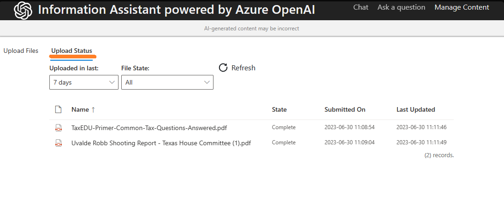

# Chat & Upload UI

## Chat Interface Screenshots

### Main Chat Interface

*Primary chat interface with conversation history and message input*

### Ask a Question Interface

*Chat interface showing question input*

### Chat with Analysis Panel

*Chat with supporting content and citations*

### Citation Document Panel

*View full document citations inline*

### Citation Section View

*Jump to specific document sections from citations*

---

## Upload Interface Screenshots

### File Upload Flow

*Step-by-step upload process with progress indicators*

### Upload Files (Alternate View)

*Additional upload interface view*

### Drag and Drop Upload

*Drag and drop files for upload*

### Upload via Link

*Upload files using direct link*

### View Upload Status

*Check upload status and progress*

---

**Asset Source**: Real UI screenshots from EVA-JP-reference local repository
