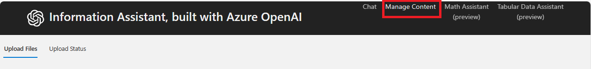
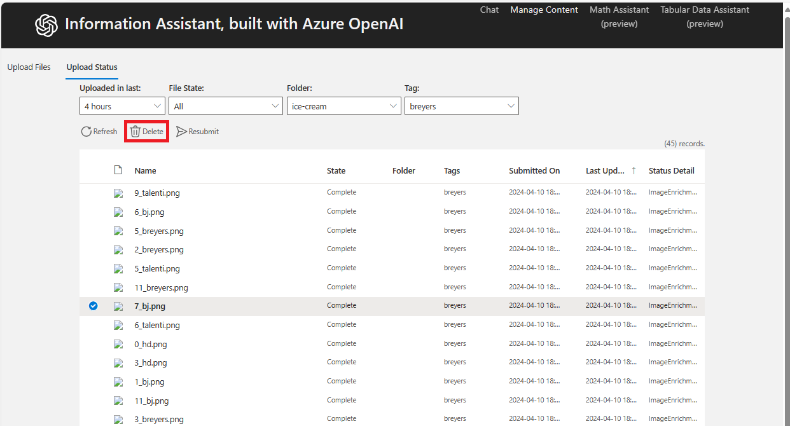
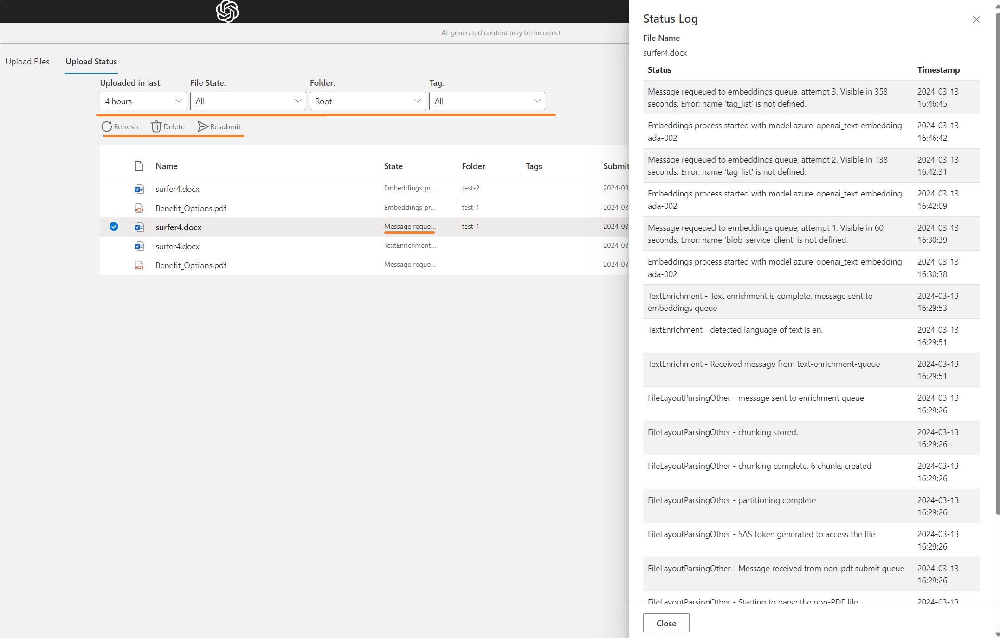
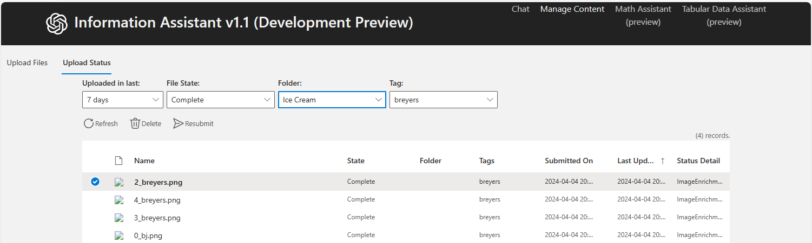

# Content Management UI

## Content Management Screenshots

### Manage Content Dashboard

*Central dashboard for document management*

### Manage Content UI

*Main content management interface*

### Delete Content

*Delete documents from the system*

### Upload Status View

*Track upload progress and status*

### View Upload Status Link

*Access upload status tracking*

### Upload Status Options

*Upload status management options*

### Delete Upload Status

*Remove upload records*

---

**Asset Source**: Real UI screenshots from EVA-JP-reference local repository
